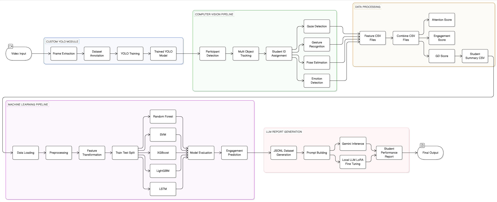

# STUDENT BEHAVIOUR ANALYSIS USING COMPUTER VISION, MACHINE LEARNING & LLM


This project is a comprehensive end-to-end intelligent system designed to analyze student behavior during group discussions or collaborative environments. It combines Computer Vision, Machine Learning, Deep Learning, and Large Language Models to extract meaningful insights from video data and generate actionable performance reports.

## PROJECT OBJECTIVE

The primary goal of this project is to automatically evaluate student participation, engagement, and behavior in group discussions using video input. Traditional evaluation methods are subjective and manual, whereas this system provides a scalable, data-driven, and automated approach.

## SYSTEM OVERVIEW

The system is designed with a modular architecture, allowing independent execution of each pipeline (YOLO, CV, ML, LLM).

The system processes input video data and performs the following:

1. Detects and tracks multiple students in real-time  
2. Extracts behavioral features such as gaze, gestures, pose, and emotions  
3. Quantifies engagement using Machine Learning and Deep Learning models  
4. Generates structured outputs and detailed performance reports  

## ARCHITECTURE



## PROJECT STRUCTURE

The project follows a modular and scalable architecture with clearly separated components for Computer Vision, Machine Learning, and LLM processing.

```txt
student-behaviour-analysis/
│
├── custom_yolo/            # YOLO model training & inference
├── cv_pipelines/           # Computer Vision pipeline (gaze, pose, emotion)
├── ml/                     # Machine Learning + LSTM models
├── llm/                    # LLM pipeline (fine-tuning + inference)
│
├── models/                 # Saved models
├── outputs/                # Generated outputs (CSV, results)
├── videos/                 # Input video files
│
├── docs/                   # Documentation & architecture diagrams
├── schema/                 # Data schema definitions
├── utils/                  # Helper / utility functions
│
├── config.py               # Global configuration
├── main.py                 # End-to-end pipeline runner
│
├── scripts                 # Environment setup and Run complete pipeline script
├── requirements.txt        # Python dependencies
│
├── .env                    # Environment variables (API keys)
├── .gitignore              # Ignore files
├── README.md               # Project documentation
```

## INSTALLATION & SETUP

This project provides simple scripts to set up the environment and run the full pipeline.

### Clone the Repository

```bash
git clone https://github.com/Sakthisel/student-behaviour-analysis.git
cd student-behaviour-analysis
```

### Setup Environment

Run the setup script to install dependencies and prepare the environment:

```bash
sh scripts/setup.sh
```

### Run Full Pipeline

Execute the complete system using:

```md
> Make sure setup.sh has execution permission:
```bash
chmod +x setup.sh scripts/run.sh
```
### Notes
- Ensure Python is installed (3.9+ recommended)
- Make sure input videos are placed in the videos/ folder
- setup.sh installs required dependencies
- run.sh executes the end-to-end pipeline

## MODULE DETAILS

### 1. CUSTOM OBJECT DETECTION (YOLO)

A custom YOLO (You Only Look Once) model is trained to detect participants in group discussions.

**Key Features:**
- Real-time multi-person detection
- High accuracy object localization
- Optimized for classroom or discussion scenarios

**Output:**
`runs/trained_models/weights/best.pt`

**Command:**
```bash
python -m custom_yolo.main
```

### 2. COMPUTER VISION PIPELINE

This module handles video processing and feature extraction.

**Process Flow:**
- Input video is split into individual frames  
- Each frame is passed through the YOLO model  
- Participants are detected and assigned unique IDs using tracking algorithms  
- Temporal consistency is maintained across frames  

**Feature Extraction:**
- Gaze Direction → Measures attention and focus  
- Gesture Analysis → Identifies hand/body movements indicating activity  
- Pose Estimation → Captures posture and physical engagement  
- Emotion Detection → Identifies expressions like interest, boredom, confusion  

**Data Handling:**
- Features are stored as CSV files per module  
- Multiple CSVs are merged into a unified dataset  
- GD (Group Discussion) scores are computed for each student  

**Final Output:**
`outputs/csv/student_summary.csv`

**Command:**
```bash
python -m cv_pipelines.main
```

### 3. MACHINE LEARNING PIPELINE

This module builds predictive models based on extracted features.

**Models Used:**
- Random Forest  
- Support Vector Machine (SVM)  
- XGBoost  
- LightGBM  

**Deep Learning:**
- LSTM (Long Short-Term Memory) model is used to capture sequential and temporal patterns in student behavior  

**Purpose:**
- Predict engagement levels based on behavioral signals  
- Learn complex relationships between features  

**Model Output:**
`models/ml_trained_models/`

**Command:**
```bash
python -m ml.main
```

### 4. ENGAGEMENT CLASSIFICATION

Each student is classified into one of the following categories:

- LOW Engagement  
- MEDIUM Engagement  
- HIGH Engagement  

This classification is based on:
- Attention Score  
- Engagement Score  
- Behavior Score  
- GD Score  

### 5. LLM-BASED REPORT GENERATION

A Large Language Model (LLM) is used to generate human-readable performance reports.

**Capabilities:**
- Converts numerical scores into meaningful insights  
- Explains student strengths and weaknesses  
- Provides recommendations for improvement  

**Example Insights:**
- Participation level  
- Communication effectiveness  
- Behavioral observations  
- Actionable suggestions  

### 6. FULL PIPELINE EXECUTION

The entire system can be executed using a single command, which runs:

- Video processing  
- Feature extraction  
- Data aggregation  
- Model prediction  
- Report generation  

**Command:**
```bash
python -m main
```

## OUTPUT SUMMARY

**YOLO Model:**
`runs/trained_models/weights/best.pt`

**CV Pipeline Output:**
`outputs/csv/student_summary.csv` 

**ML Models:**
`models/trained_models` 

**Visualization:**
`outputs/visualizations`

**LLM Output:**
Generated textual performance reports  

## KEY FEATURES

- Multi-person detection and tracking  
- Behavioral analysis using visual cues  
- Ensemble Machine Learning models  
- Temporal analysis using LSTM  
- Automated report generation using LLM  
- Modular and scalable architecture  

## USE CASES

- Classroom performance evaluation  
- Online learning analytics  
- Group discussion analysis  
- Interview assessment  
- Behavioral research  

## TECHNOLOGY STACK

### AI / Machine Learning
- **Scikit-learn** – Traditional ML models  
- **XGBoost / LightGBM** – Gradient boosting algorithms  
- **TensorFlow / PyTorch** – Deep learning (LSTM, model training)  
- **Transformers / LLMs** – AI-based report generation and insights  

### Computer Vision
- **OpenCV** – Image and video processing  
- **YOLO (Ultralytics)** – Object detection  
- **MediaPipe** – Pose, gesture, and facial tracking  

### Backend
- **Python** – Core application logic  
- **FastAPI** – High-performance API framework  

### Frontend
- **React.js** – Interactive UI and dashboard  

## CONCLUSION

This project demonstrates a complete AI pipeline combining Computer Vision, Machine Learning, Deep Learning, and Natural Language Processing to analyze student behavior and generate meaningful insights for evaluation and improvement.# student-behaviour-analysis

## AUTHOR

**Sakthivel Vinayagam**  
Senior / Lead Frontend & Full Stack Engineer  
📧 Email: sakthisel007@gmail.com  
🐙 GitHub: https://github.com/Sakthisel

[](https://sakthivelv-portfolio.netlify.app)
[](https://www.linkedin.com/in/sakthiselv)
