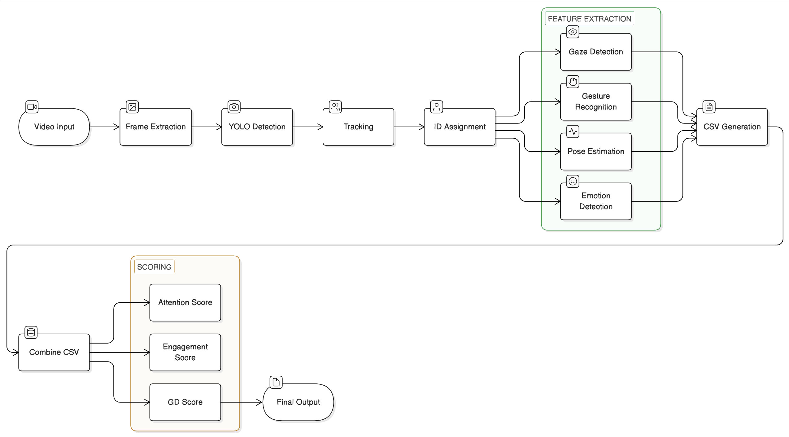

# Custom YOLO Model

This module trains and runs a custom YOLO model for detecting task-specific objects (e.g., scale, blocks, tools, students) from images or videos.

## Custom YOLO Architecture



## Project Structure

```txt
custom_yolo/
│
│── dataset/                  # Dataset root
│   ├── images/
│   │   ├── all/              # Raw images (before split)
│   │   ├── train/            # Training images
│   │   └── val/              # Validation images
│   │
│   ├── labels/
│   │   ├── all/              # Raw annotations
│   │   ├── train/            # Training labels
│   │   └── val/              # Validation labels
│
├── data/
│   ├── image_extraction.py    # Frame extraction
│   └── split_train_val.py     # Dataset split
│
├── training/
│   └── yolo_train.py          # Training logic
│
├── inference/
│   └── yolo_predict.py        # Detection logic
│
├── config/
│   └── objects.yaml           # Class & dataset config
│
├── models/                    # Pretrained weights
├── runs/                      # Training outputs (best.pt)
│
├── README.md
```

## Requirements

Install dependencies before running:

`pip install ultralytics opencv-python label-studio`

Optional:
For GPU acceleration, install a CUDA-compatible version of PyTorch.

## How to Run

### Step 1: Extract images from video

`python -m custom_yolo.data.image_extraction`

Input videos should be placed in:
`../videos/classroom_sample.mov`

### Step 2: Annotate data using Label Studio

Start Label Studio:

`label-studio start`

Steps:
- Open the UI in your browser
- Upload extracted images from dataset/images/all/
- Create bounding box annotations
- Export annotations to dataset/labels/all/ in YOLO format

### Step 3: Split dataset

`python -m custom_yolo.data.split_train_val`

This splits data from:
- dataset/images/all/ → train/, val/
- dataset/labels/all/ → train/, val/

### Step 4: Configure dataset (objects.yaml)

Ensure objects.yaml contains:

train: `../dataset/images/train`
val: `../dataset/images/val`

nc: 4

names:
  - block
  - laptop
  - scale
  - student

### Step 5: Train model and run prediction

`python -m custom_yolo.main`

This will:
- Train YOLO on the custom dataset
- Save trained weights in runs/train/
- Store training logs and metrics
- Run inference using the trained model
- Save predictions (with bounding boxes) in runs/detect/

## Output

- Trained model: `custom_yolo/runs/train_models/`
- Predictions: `custom_yolo/runs/inference_results/`

## Important Notes

- Dataset must follow YOLO format:
  - Matching filenames: image.jpg ↔ image.txt
  - Separate images/ and labels/ folders

- Do NOT manually modify train/val folders — use the split script
- The all/ folder acts as the master dataset
- Ensure objects.yaml paths match your folder structure
- GPU is highly recommended for faster training

## Summary

This module builds a custom object detection model using YOLO, which is used in the CV pipeline to detect and track participants and relevant objects in group discussions.