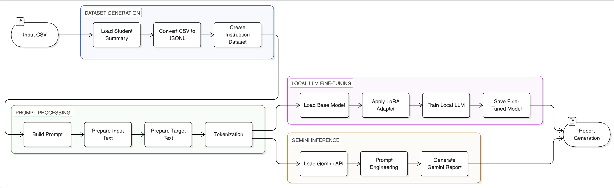

# Fine-Tune LLM and Use Gemini

This section explains how to use student performance data within an LLM pipeline. It covers both fine-tuning (for local models) and using Google Gemini for inference.

## LLM Pipeline Architecture



## LLM Pipeline Structure

```txt
llm/
│
├── main.py                    # Entry point (run LLM pipeline)
│
├── config/
│   └── config.py              # Model + path configs
│
├── data/
│   ├── student_reports.jsonl  # Training dataset
│   ├── data_loader.py         # Load dataset
│   └── generate_dataset.py    # Convert CSV → JSONL
│
├── preprocessing/
│   └── preprocessing.py       # Clean/format prompts
│
├── models/
│   └── model_loader.py        # Load base + LoRA models
│
├── training/
│   └── training.py            # Fine-tuning logic
│
├── inference/
│   ├── inference.py           # Local LLM inference
│   └── gemini.py              # Gemini API inference
│
├── prompts/
│   └── prompt_builder.py      # Prompt templates
│
├── evaluation/
│   └── evaluation.py          # Output evaluation
│
├── tokenizer/
│   └── tokenizer.py           # Tokenization logic
│
├── README.md
```

## Dataset Preparation Output

After running the gaze, gesture, pose, and emotion pipelines, the final summary is stored in CSV format.

Example:
`outputs/csv/student_summary.csv`

```csv
student_id,attention_score,engagement_score,gd_score,target
0,2.425196850393701,1.905511811023622,4.330708661417323,0
2,2.1496062992125986,1.7322834645669292,3.8818897637795278,0
1,2.047244094488189,1.7401574803149606,3.7874015748031495,0
```

## Convert CSV to JSONL

Convert the dataset into JSONL format for LLM training or inference.

Run:
`python -m llm.data.generate_dataset`

Example JSONL format:

```json
{"instruction": "Analyze student performance", "input": "{\"student_id\": 0, \"attention_score\": 0.99, \"engagement_score\": 2.53, \"gd_score\": 3.52, \"target\": 1}", "output": "{\"student_id\": 0, \"engagement\": 1, \"gd_score\": 3.52, \"summary\": \"Attention 0.99, Engagement 2.53\"}"}
```

## Fine-Tuning LLM (Local Models)

If you are using open-source models (not Gemini), you can fine-tune them using LoRA.

Run:
`python -m llm.main`

You can verify the fine-tuned model by running:
`python -m llm.main`

This will generate reports using the fine-tuned LLM.

Note:
This approach works with models like LLaMA and Mistral, not Gemini.

Supported models:
- LLaMA
- Mistral
- FLAN-T5 (optional lightweight model)

## Using Google Gemini (Recommended)

Instead of fine-tuning, you can directly use Gemini for inference.

Model:
`gemini-2.0-flash (recommended)`

Install SDK:
`pip install google-generativeai`

Example usage:

```python
import google.generativeai as genai
import json

genai.configure(api_key="YOUR_API_KEY")

model = genai.GenerativeModel("gemini-2.0-flash")

data = {
    "student_id": 0,
    "attention_score": 0.99,
    "engagement_score": 2.53,
    "gd_score": 3.52
}

prompt = "Analyze student performance and return JSON output.\n\nInput:\n" + json.dumps(data) + "\n\nOutput format:\n{\n \"student_id\": int,\n \"engagement\": \"LOW | MEDIUM | HIGH\",\n \"summary\": \"short explanation\"\n}"

response = model.generate_content(prompt)
print(response.text)
```

## Key Notes

- Gemini does NOT require fine-tuning for this workflow
- Use prompt engineering for better results
- Fine-tuning applies only to local LLMs
- Ensure JSONL format is valid before training
- Keep input-output format consistent

## Recommendation

For this project:

- Use Gemini for fast and simple inference
- Use a local LLM with LoRA only if:
  - Offline capability is required
  - Custom behavior or domain-specific tuning is needed