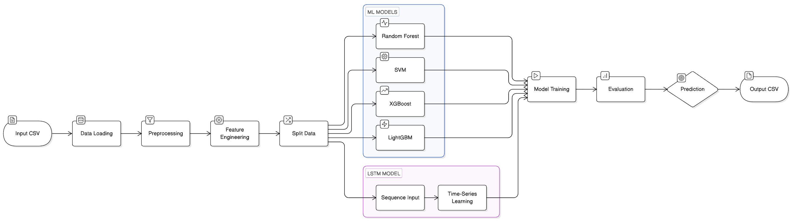

# Machine Learning Pipeline (ML & LSTM)

This section explains how student behavioral data is processed using Machine Learning and Deep Learning models to predict engagement levels.

## ML Pipeline Architecture



## ML Pipeline Structure

```txt
ml/
│
├── main.py                      # Entry point (train + evaluate pipeline)
│
├── config/
│   └── config.py               # ML configuration (paths, params)
│
├── data/
│   ├── data_loader.py          # Load dataset
│   ├── preprocessing.py        # Data cleaning
│   ├── transformation.py       # Feature engineering
│   └── split.py                # Train-test split
│
├── models/
│   ├── models.py               # Model definitions (RF, SVM, etc.)
│   ├── training.py             # Training logic
│   └── prediction.py           # Inference logic
│
├── evaluation/
│   └── evaluation.py           # Metrics & evaluation
│
├── analysis/
│   └── eda.py                  # Exploratory Data Analysis
│
├── utils/
│   └── utils.py                # Helper functions
│
├── README.md
```

## Dataset Input

After the Computer Vision pipeline, the processed dataset is stored in CSV format.

Example:
outputs/csv/student_summary.csv

```csv
student_id,attention_score,engagement_score,gd_score,target
0,2.42,1.90,4.33,0
2,2.14,1.73,3.88,0
1,2.04,1.74,3.78,0
```

## Data Processing Pipeline

The ML pipeline follows these steps:

1. Load dataset  
2. Data cleaning and preprocessing  
3. Feature selection  
4. Feature transformation (scaling + encoding)  
5. Train-test split  
6. Model training  
7. Model evaluation  
8. Predictions  

## Load Data

Load the dataset from CSV:

Run:
`python -m ml.data_loader`

This reads:
`outputs/csv/student_summary.csv`

## Data Preparation

Clean and preprocess the dataset:

- Handle missing values  
- Convert data types  
- Normalize input format  

## Feature Transformation

Apply transformations:

- Label Encoding (for categorical values)  
- Scaling (StandardScaler / MinMaxScaler)  

Features used:
- attention_score  
- engagement_score  
- gd_score  

## Train-Test Split

Split dataset into:

- Training set  
- Testing set  

Typical ratio:
80% training / 20% testing  

## Model Training

Multiple ML models are trained:

- Random Forest  
- Support Vector Machine (SVM)  
- XGBoost  
- LightGBM  

Run:
```python -m ml.main```

Models are saved in:
`models/ml_trained_models/`

## LSTM Model (Deep Learning)

For sequential/temporal learning, LSTM is used.

Purpose:
- Capture time-based behavior patterns  
- Improve prediction accuracy  

## Model Evaluation

Evaluate models using:

- Accuracy  
- Precision  
- Recall  
- F1 Score  

Best model is selected automatically.

## Predictions

Predict student engagement levels:

Labels:
- 0 → LOW  
- 1 → MEDIUM  
- 2 → HIGH  

Example:

Input:
attention_score = 2.4  
engagement_score = 1.9  
gd_score = 4.3  

Output:
MEDIUM  

## Predict Using Trained Model

Batch prediction:

`python -m ml.predict`

Or programmatically:

```python
from ml.predict import predict_single_model

result = predict_single_model(sample_dict)
print(result)
```

## Saved Artifacts

After training, the following files are saved:

- models/ml_trained_models/best_ml_model.pkl  
- models/ml_trained_models/features.pkl  
- models/ml_trained_models/scaler.pkl  
- models/ml_trained_models/encoders.pkl  

## Key Notes

- Ensure dataset is clean before training  
- Features must match during training and prediction  
- Always load scaler and encoders for inference  
- LSTM requires properly shaped sequential data  

## Recommendation

For this project:

- Use ensemble ML models for strong baseline performance  
- Use LSTM for advanced sequence modeling  
- Combine ML predictions with LLM for final insights  

## Summary

This ML pipeline converts raw behavioral data into structured predictions, enabling automated evaluation of student engagement.

It acts as the backbone of the system before LLM-based report generation.